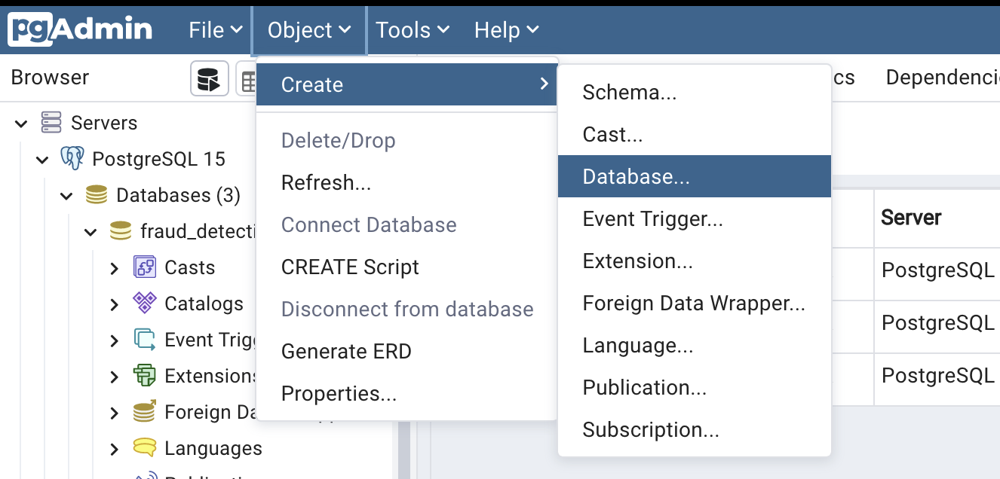
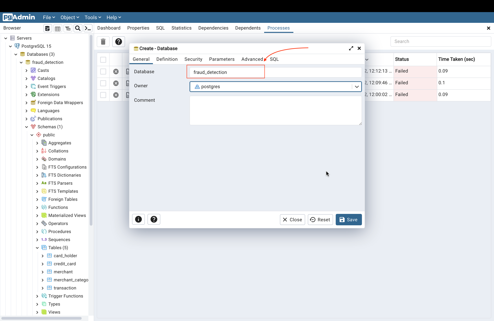
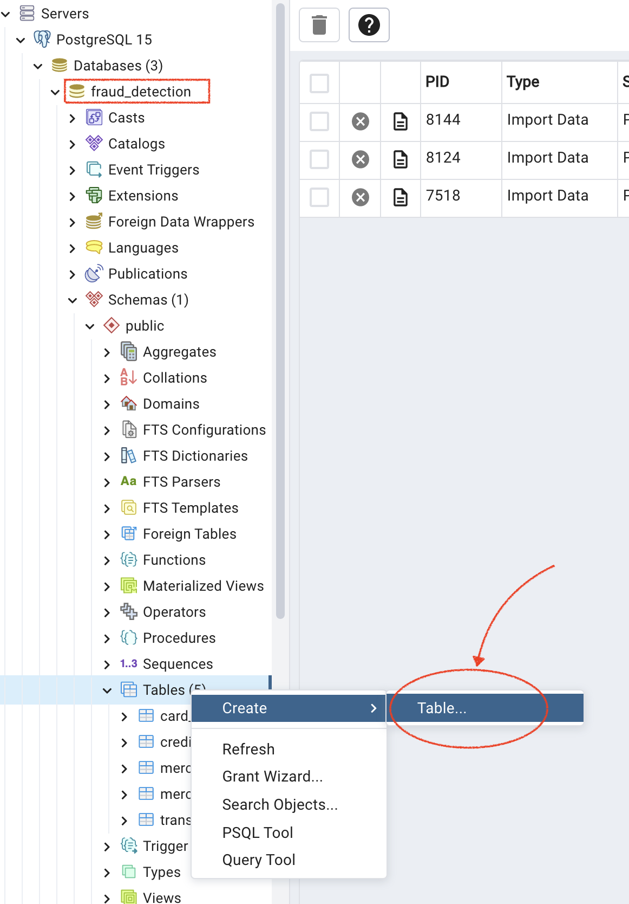
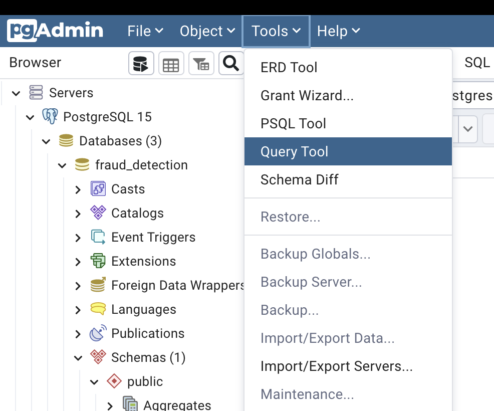
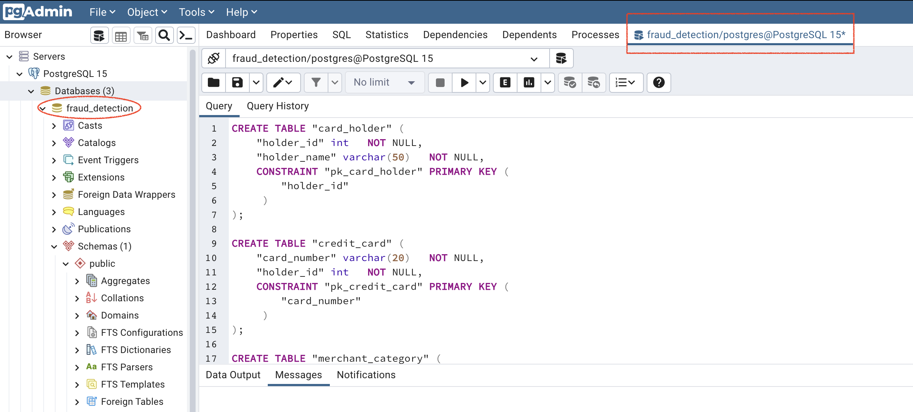

# Installation

1. Install pgAdmin 4
> * https://www.pgadmin.org/download/pgadmin-4-macos/
2. Install PostgreSQL v15
> * https://www.enterprisedb.com/downloads/postgres-postgresql-downloads

3. Install hvplot and psycopg2

```
python -V
>>> Python 3.8.15

conda install -c conda-forge hvplot
conda install psycopg2
```

4. Install other dependencies
```
pip install -r requirements.txt
```

5. Download Module-7 Activity Files from Bootcamp

6. Create ERD for tables in fraud_detection database
> * https://www.quickdatabasediagrams.com/
> * ERD.svg (reference image)


7. Create database in pgadmin4


```
username: postgres
password: postgres
```

8. Create Tables in PgAdmin4 under `fraud_detection` database using the ERD as the reference

OPTION 1:

OPTION 2:
* Using Query Tool in PgAdmin4 and schema.sql generated from https://www.quickdatabasediagrams.com/




9. Add seed data (CSV) to tables
    * Use the `.sql` files in `Data/` and `query tool` is PgAdmin4

7. Run the notebook `visual_data_analysis.ipynb` and follow the instructions / comment to analyze the data